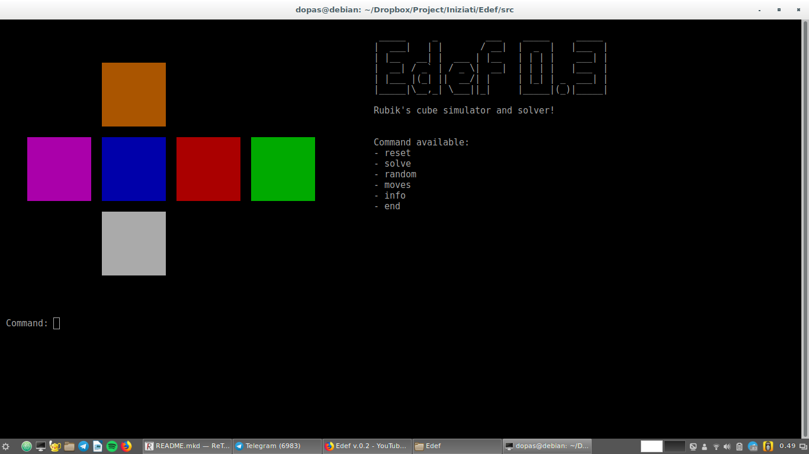
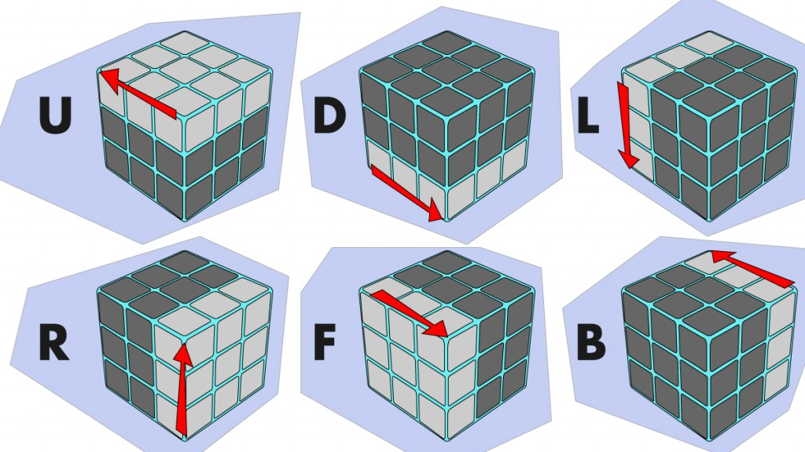
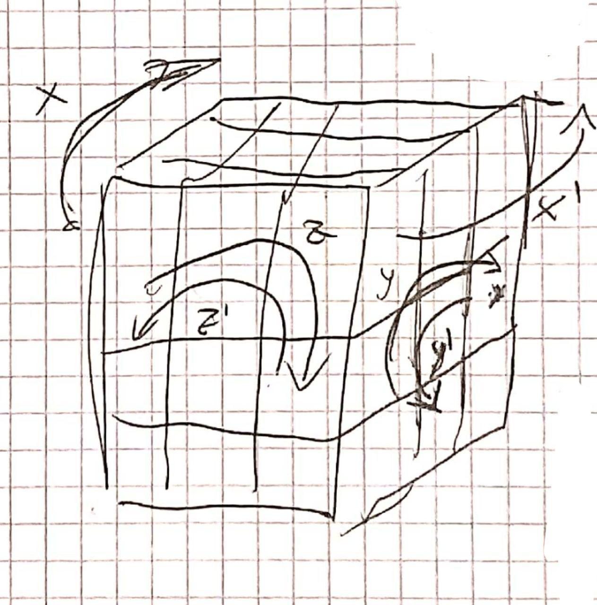
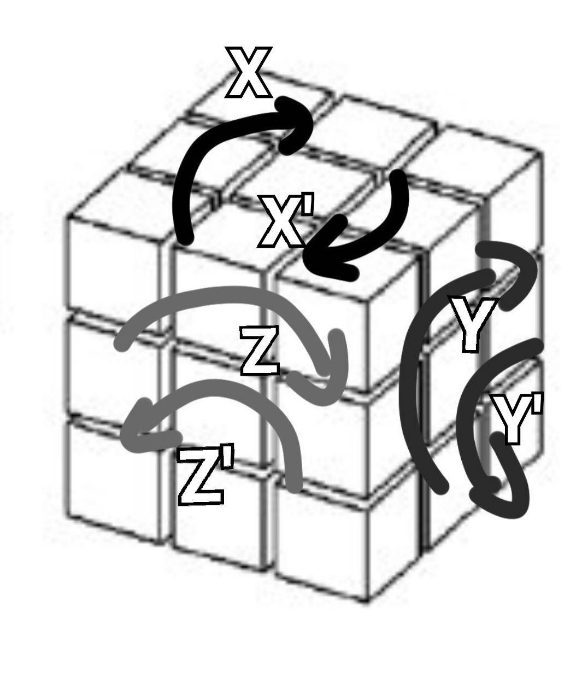

# Edef
Edef is a virtual simulator and solver of the Rubik's cube (classic version 3x3x3). Fully developed from scratch in C, with ncurses as a graphic library for the terminal.

[](https://www.youtube.com/watch?v=hZ2u8HZT35c)


## The method used for solving cube is:

1. First Layer Cross
2. First Layer Corners
3. Second Layer Edges
4. OLL Simplified (3 for cross, 7 for corners)
5. Permutate Last Layer (PLL from Fridrich)

---

# The abstraction

Before understanding how it works, you need to understand how it is done.


## The structure
I divided the cube into 27 pieces (parts) each of which corresponds to a structure consisting of:

- type;
- (1) top color;
- (2) front color;
- (3) right color;
- (4) back color;
- (5) left color;
- (6) bottom color.

And then I defined it:

```c
typedef struct
{
	short int type;
	short int top;
	short int front;
	short int right;
	short int back;
	short int left;
	short int bottom;
} part;
```

The value that the variables will assume will correspond to the color of that side of the single piece. But as we all know, the pieces do not have all six visible sides, they actually do not have six facades but this will come in handy later.

## The colors
The cube is composed of 6 colors, to each of them I have recognized an identifier (ID):

| Color  | ID  |
|--------|----:|
| Yellow |   0 |
| Blue   |   1 |
| Red    |   2 |
| Green  |   3 |
| Orange |   4 |
| White  |   5 | 

## The types

I distinguished three types of parts:

| Type          | ID | Description               | Number of parts  |
| -------------:| --:|:-------------------------:| ----------------:|
| Head          |  1 | Central to each facade    |                6 |
| Edge          |  2 | Part with two colors      |               12 |
| Corner        |  3 | Part with three colors    |                8 |

So I've created a three-dimensional parts matrix(3x3x3 like Rubik's cube):

```c
part cube[3][3][3];
```
## The inizialization

Once the structure has been defined, as a whole, it is necessary to initialize it with the types and colors for each piece of this. The faces of each piece covered will be set to -1.

### First inizialization:
```c
for (i = 0; i < 3; i++)
	for (j = 0; j < 3; j++)
		for (k = 0; k < 3; k++)
			for (l = 1; l < 7; l++)
				*((short int*) &cube[i][j][k] + l) = -1;
```
### Piece-by-piece initialization
Each piece of this matrix has a type and visible colors, so each piece must be initialized with his type and colors.
An example:
```c
cube[0][0][0].type = 3;
cube[0][0][0].top = 0;
cube[0][0][0].back = 3;
cube[0][0][0].left = 4;
```

## The moves
Once you have identified the structure, the pieces and the colors, the thing that remains to do is to try to define the cube's moves.
When you learn how to make the Rubik's cube, the first thing you learn is the notation. The main basic moves that you can do are:

| Move | Inverse | Meaning |
|------|---------|---------|
| U    | U'      | Up      |
| D    | D'      | Down    |
| L    | L'      | Left    |
| R    | R'      | Right   |
| F    | F'      | Front   |
| B    | B'      | Back    |

(inverse means counterclockwise)



By applying these moves on the different layers and combining them you can get all the moves contained in the notation.

[Here](https://ruwix.com/the-rubiks-cube/notation/) you can find complete notation.

The thing that can be noticed is that a move, if applied to another level, will become a different move, for example: if we apply U to the 3 layer we will get D '.

This allows to generalize a series of moves: I have identified three moves: X, Y, Z with their respective inverse X', Y', Z' which applied at different levels allow you to generate all the cube moves.

| General move | Moves that allows |
|--------------|-------------------|
| X            | U, E', D'         |
| X'           | U', E, D          |
| Y            | R, M', L'         |
| Y'           | R', M, L          |
| Z            | F, S, B'          |
| Z'           | F', S', B         |




In reality the moves are rotations, clockwise or not, of the various pieces of a layer.
We can see an example of X move on a single piece:

```c
void x(part *dest, part *from)
{
	dest->top =    from->top;
	dest->front =  from->right;
	dest->right =  from->back;
	dest->back =   from->left;
	dest->left =   from->front;
	dest->bottom = from->bottom;
}
```

And, this is on the whole layer:
```c
memcpy(tmp, cube[height][0], 3 * sizeof(part));
x(&cube[height][0][1], &cube[height][1][0]);
x(&cube[height][0][0], &cube[height][2][0]);
x(&cube[height][1][0], &cube[height][2][1]);
x(&cube[height][2][0], &cube[height][2][2]);
x(&cube[height][2][1], &cube[height][1][2]);
x(&cube[height][0][2], &tmp[0]);
x(&cube[height][1][2], &tmp[1]);
x(&cube[height][2][2], &tmp[2]);
```

## High level usage

So, when you insert a string composed of moves, it splits the string and executes them one-by-one.
Returning to the previous example, when you need to execute the U move, it will actually execute the X move on the first layer, which in turn will execute the X move on all the pieces of that layer.

# The resolution

In short, what the algorithm does to automatically solve the cube is to search, layer by layer, the piece it needs and adopt an algorithm in the place it wants. To do this I studied all the possible cases and wrote the algorithms that solve them.
